# Project: Build a Traffic Sign Recognition Program

[](http://www.udacity.com/drive)

[TOC]

##1. Overview
The goal of this project is to build the traffic sign recognition successfully.

The dataset is from [German Traffic Sign Dataset](http://benchmark.ini.rub.de/?section=gtsrb&subsection=dataset). After the model is trained, 5 test images picked from internet are used to test the model accuracy.

The goals / steps of this project are the following:

- Load the data set
- Explore, summarize and visualize the data set
- Design, train and test a model architecture
- Use the model to make predictions on new images
- Analyze the softmax probabilities of the new images
- Summarize the results with a written report


##2. Project Preparation

1. Dependencies

   This lab requires [CarND-Term1-Starter-Kit](https://github.com/udacity/CarND-Term1-Starter-Kit)

   The lab environment can be created with CarND Term1 Starter Kit. Click [here](https://github.com/udacity/CarND-Term1-Starter-Kit/blob/master/README.md) for the details.

2. Dataset and Repository

3. Download the data set. The classroom has a link to the data set in the "Project Instructions" content. This is a pickled dataset in which we've already resized the images to 32x32. It contains a training, validation and test set.

4. Clone the project, which contains the Ipython notebook and the writeup template.

```sh
git clone https://github.com/udacity/CarND-Traffic-Sign-Classifier-Project
cd CarND-Traffic-Sign-Classifier-Project
jupyter notebook Traffic_Sign_Classifier.ipynb
```

##3. Project Introduction
This project is using the convolutional neural network to classify the German traffic sign. The advantage of using the CNN is that it can improve the accurary based on the huge dataset comparing the traditional image process, such as OpenCV.
The model of CNN in this project is based on LeNet-5 from the class.

##4. Project Pipeline
The workflow of this project is followed by the pipeline below:

1. *Design and Test a Model Architecture*
	1. Preprocessing
	2. Model Architecture
	3. Model Training
	4. Solution Approach
2. *Test a Model on New Images*
	1. Acquiring New Images
	2. Performance on New Images
	3. Model Certainty - Softmax Probabilities

###4.1 Design and Test a Model Architecture
####4.1.1 Preprocessing

1. Data Load

   The convolutional neural network needs quite a lot of data.  [German Traffic Sign Dataset](http://benchmark.ini.rub.de/?section=gtsrb&subsection=dataset) provides the examples and the labels. The first block is to read the training examples, the validation examples and the test examples.

   ````python
   training_file = './train.p'
   validation_file= './valid.p'
   testing_file = './test.p'

   with open(training_file, mode='rb') as f:
       train = pickle.load(f)
   with open(validation_file, mode='rb') as f:
       valid = pickle.load(f)
   with open(testing_file, mode='rb') as f:
       test = pickle.load(f)
       
   X_train, y_train = train['features'], train['labels']
   X_valid, y_valid = valid['features'], valid['labels']
   X_test, y_test = test['features'], test['labels']
   ````

   The groups of different examples are ready. `X_train` and `y_train` are for training examples; `X_valid` and `y_valid` are for validation examples; and `X_test` and `y_test` are for test examples.

   The size of each group can also be extracted by simply using `numpy`:

   ````python
   n_train = len(X_train)
   n_validation = len(X_valid)
   n_test = len(X_test)
   image_shape = X_train[0].shape
   n_classes = len(np.unique(y_train))
   ````

   ````sh
   # Output
   Number of training examples = 34799
   Number of testing examples = 12630
   Image data shape = (32, 32, 3)
   Number of classes = 43
   ````

2. Data Visualization

   Visualizing the examples is easier for understanding and for preprocessing. The visualization is separated into 3 parts: 

   * Randomly plot 1 training example and its class
   * Plot the number of traffic sign in the training examples and in the test examples
   * Plot all the classes with classes' number and sign name

   ````python
   import random
   import matplotlib.pyplot as plt

   %matplotlib inline

   index = random.randint(0, len(X_train))
   image = X_train[index].squeeze()
   plt.figure(figsize=(1,1))
   plt.imshow(image)
   print(y_train[index])
   ````

   ````
   # Output
   11
   ````

   

   The motivation to plot the number of traffic sign type is to check if there is uneven distribution. The uneven distribution will have impact on the accurary if the regularization is missiong. For instance, if the data set has much more example on the class 11 than on the class 1, the prediction will be more likely to predict the class 11.

   

   The result shows that the distribution is uneven, *bias* is necessary.

   The following figure shows the classes.

   ````python
   rows, cols = 4, 12

   fig, ax = plt.subplots(rows, cols, figsize=(15,15)) 
   plt.suptitle('Training set classes')
   for i_class, i_ax in enumerate(ax.ravel()):
       if i_class < n_classes:
           X = X_train[y_train == i_class]
           img = X[np.random.randint(len(X))]
           i_ax.imshow(img)
           i_ax.set_title('{:02d}'.format(i_class))
       else:
           i_ax.axis('off')

   plt.setp([a.get_xticklabels() for a in ax.ravel()], visible=False)
   plt.setp([a.get_yticklabels() for a in ax.ravel()], visible=False)

   plt.draw()
   ````

   

3. Pre-process the data set

   The following technique is used to pre-process the data set:

   * Normalisation and RGB2GREY
   * More data generation

   1. Normalisation and RGB2GREY

      - `clahecvt_norm`

        CLAHE is the abbreviation of Contrast-limited Adaptive Histogram Equalization. Histogram equalization is a method in image processing of contrast adjustment using the image's histogram.  

        > This method usually increases the global contrast of many images, especially when the usable data of the image is represented by close contrast values. Through this adjustment, the intensities can be better distributed on the histogram. This allows for areas of lower local contrast to gain a higher contrast. Histogram equalisation accomplishes this by effectively spreading out the most frequent intensity values.
        >
        > The method is useful in images with backgrounds and foregrounds that are both bright or both dark. 
        >
        > > [Histogram Equlization]: https://en.wikipedia.org/wiki/Histogram_equalization

        ```python
        def clahecvt_norm(original_images, m, image_shape):
            clahe = cv2.createCLAHE()
            clahe_images = np.ndarray(shape=(m, image_shape[0], image_shape[1], 1), dtype=np.uint8)
            for i in range(len(original_images)):
                image = original_images[i].squeeze()
                gray_image = cv2.cvtColor(image, cv2.COLOR_RGB2GRAY)
                clahe_images[i,:,:,0] = clahe.apply(gray_image)
            clahe_images = clahe_images.astype(int)
            clahe_images -= 128
            return clahe_images
        
        def rgb2clahe(x_train, x_valid, x_test, m_train, m_valid, m_test, img_shape):
            x_train_cl = clahecvt_norm(x_train, m_train, img_shape)
            x_valid_cl = clahecvt_norm(x_valid, m_valid, img_shape)
            x_test_cl = clahecvt_norm(x_test, m_test, img_shape)
            return x_train_cl, x_valid_cl, x_test_cl
        
        # used in the pipline
        X_train_cl, X_valid_cl, X_test_cl = rgb2clahe(X_train, X_valid, X_test, n_train, n_validation, n_test, image_shape)
        ```

      - `rgb2yuv_norm`

        This method is referred to the article:

        > [Traffic Sign Recognition with Multi-Scale Convolutional Networks]: http://yann.lecun.com/exdb/publis/pdf/sermanet-ijcnn-11.pdf

        ```python
        def rgb2yuv_norm(X, equalize_hist=True):
            X = np.array([np.expand_dims(cv2.cvtColor(rgb_img, cv2.COLOR_RGB2YUV)[:, :, 0], 2) for rgb_img in X])
            if equalize_hist:
                X = np.array([np.expand_dims(cv2.equalizeHist(img), 2) for img in X])
            X = np.float32(X)
            # Standardize features
            X -= np.mean(X, axis=0)
            X /= (np.std(X, axis=0) + np.finfo('float32').eps)
            return X
        
        def rgb2yuv(x_train, x_valid, x_test):
            x_train_yuv = rgb2yuv_norm(x_train);
            x_valid_yuv = rgb2yuv_norm(x_valid);
            x_test_yuv = rgb2yuv_norm(x_test);
            return x_train_yuv, x_valid_yuv, x_test_yuv
        
        # unused method
        X_train_yuv, X_valid_yuv, X_test_yuv = rgb2yuv(X_train, X_valid, X_test)
        ```

        > YUV is a color encoding system typically used as part of a color image pipeline. It encodes a colour image or video taking human perception into account, allowing reduced bandwidth for chrominance components, thereby typically enabling transmission errors or compression artefacts to be more efficiently masked by the human perception than using a "direct" RGB-representation. Other colour encodings have similar properties, and the main reason to implement or investigate properties of Y′UV would be for interfacing with analog or digital television or photographic equipment that conforms to certain Y′UV standards.
        >
        > > []: https://en.wikipedia.org/wiki/YUV

      These 2 methods are using different normalisation. `clahecvt_norm` normalises the data between -127 to 128, and `rgb2yuv_norm` normalises the data by using standard normalisation. 

       The output shows below.

      ```
      # Output
      Right-of-way at the next intersection
      <matplotlib.image.AxesImage at 0x12c032240>
      ```

      

      In the submitted version, `clahecvt_norm` is chosen because it gets higher validation accuracy.


   2. More data generator

      In the project, the data generator is also implemented by simply using `Keras` framework. One-line code `keras.preprocessing.image.ImageDataGenerator(…)` can generate new images with `rotation_range`, `zoom_range`, `width_shift_range` and `height_shift_range`.

      ```python
      from keras.preprocessing.image import ImageDataGenerator
      
      # creat the generator to perform online data augmentation
      image_datagen = ImageDataGenerator(rotation_range=15., zoom_range=0.2, width_shift_range=0.1, height_shift_range=0.1)
      ```

      The output plot takes a random image from training set, and is shown as below.

      ```python
      # take a random image from the training set
      img_rgb = X_train[10]
      
      # plot the original image
      plt.figure(figsize=(1,1))
      plt.imshow(img_rgb)
      plt.title('Example of RGB image (class = {})'.format(y_train[10]))
      plt.axis('off')
      plt.show()
      
      # plot some randomly augmented images
      rows, cols = 4, 10
      fig, ax_array = plt.subplots(rows, cols)
      for ax in ax_array.ravel():
          augmented_img, _ = image_datagen.flow(np.expand_dims(img_rgb, 0), y_train[10:11]).next()
          ax.imshow(np.uint8(np.squeeze(augmented_img)))
      plt.setp([a.get_xticklabels() for a in ax_array.ravel()], visible=False)
      plt.setp([a.get_yticklabels() for a in ax_array.ravel()], visible=False)
      plt.suptitle('Random examples of data augment (starting from the previous image)')
      plt.show()
      ```

      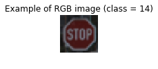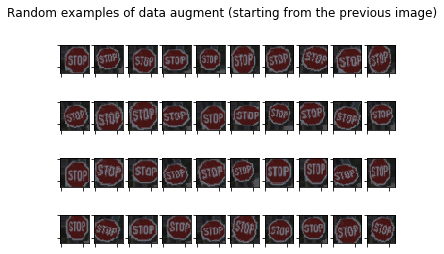

####4.1.2 Model Architecture

There are 3 parts in this chapter.

- The model: *LeNet*
- The regularization: *Regularization* and *Dropout*
- Optimization: *Batch Normalization* and *Adam*

1. The model *LeNet* is chosen in this project. Here is the model architecture.


​	The code of this model is as following.

````python
def LeNet(x):    
    # Arguments used for tf.truncated_normal, randomly defines variables for the weights and biases for each layer
    mu = 0
    sigma = 0.1
    
    # Layer 1: Convolutional. Input = 32x32x1. Output = 28x28x6.
    conv_W1 = tf.Variable(tf.truncated_normal(shape=(5, 5, 1, 6), mean=mu, stddev=sigma))
    conv_b1 = tf.Variable(tf.zeros(6))
    conv1 = tf.nn.conv2d(x, conv_W1, strides = [1, 1, 1, 1], padding = 'VALID') + conv_b1
    # BN
    conv1_BN = batch_normalization(conv1, 6, epsilon)
    # Activation.
    conv1 = tf.nn.relu(conv1_BN)
    # Pooling. Input = 28x28x6. Output = 14x14x6.
    conv1 = tf.nn.max_pool(conv1, ksize = [1, 2, 2, 1], strides = [1, 2, 2, 1], padding = 'VALID')
    # Dropout L1
    conv1 = tf.nn.dropout(conv1, keep_prob=1)
    
    # Layer 2: Convolutional. Output = 10x10x16.
    conv_W2 = tf.Variable(tf.truncated_normal(shape=(5, 5, 6, 16), mean=mu, stddev=sigma))
    conv_b2 = tf.Variable(tf.zeros(16))
    conv2 = tf.nn.conv2d(conv1, conv_W2, strides = [1, 1, 1, 1], padding = 'VALID') + conv_b2
    # BN
    conv2_BN = batch_normalization(conv2, 16, epsilon)
    # Activation.
    conv2 = tf.nn.relu(conv2_BN)
    # Pooling. Input = 10x10x16. Output = 5x5x16.
    conv2 = tf.nn.max_pool(conv2, ksize = [1, 2, 2, 1], strides = [1, 2, 2, 1], padding = 'VALID')
    # Dropout L2
    couv2 = tf.nn.dropout(conv2, keep_prob=1)
    
    # Flatten. Input = 5x5x16. Output = 400.
    fc0 = flatten(conv2)
    
    # Layer 3: Fully Connected. Input = 400. Output = 120.
    fc1_W = tf.Variable(tf.truncated_normal(shape=(400, 120), mean=mu, stddev=sigma))
    fc1_b = tf.Variable(tf.zeros(120))
    fc1 = tf.matmul(fc0, fc1_W) + fc1_b
    # Activation.
    # fc1 = tf.nn.relu(fc1)
    # Play around, append dropout.
    fc1 = tf.nn.dropout(fc1, keep_prob = keep_probs)

    # Layer 4: Fully Connected. Input = 120. Output = 84.
    fc2_W = tf.Variable(tf.truncated_normal(shape=(120, 84), mean=mu, stddev=sigma))
    fc2_b = tf.Variable(tf.zeros(84))
    fc2 = tf.matmul(fc1, fc2_W) + fc2_b
    # Activation.
    fc2 = tf.nn.relu(fc2)

    # Layer 5: Fully Connected. Input = 84. Output = n_classes.
    fc3_W = tf.Variable(tf.truncated_normal(shape=(84, n_classes), mean=mu, stddev=sigma))
    fc3_b = tf.Variable(tf.zeros(n_classes))
    logits = tf.matmul(fc2, fc3_W) + fc3_b
    
    return logits
````


2. The **regularization** is added to avoid the model over-fit, which often occurs when the training set has high accuracy but the validation set has low accuracy. Especially,  the data generator is enable, the **regularization** is the good method to keep the over-fit away.

   There are 2 regularization methods:

   * Dropout

   * Regularization

   1. Dropout: `fc1 = tf.nn.dropout(fc1, keep_prob = keep_probs)`

     If the learned hypothesis fit the training set very well, but fail to generalize to new examples, the over-fitting occurs. The regularization *Dropout* is the method to avoid the over-fitting. It is a widely used regularization technique that is specific to deep learning.

     *Dropout* is to set some probability of eliminating a node in a neural network of each layer. It randomly shuts down some neurons in each iteration. In this model, the parameter `keep_prob` is set for `Layer 4` with the value 0.8. 0.8 means 80% of chance to keep the node and the other 20% of chance to remove the node.

     When some neurons are shut down, we actually modify our model. The idea behind drop-out is that at each iteration, we train a different model that uses only a subset of our neurons. With dropout, our neurons thus become less sensitive to the activation of one other specific neuron, because that other neuron might be shut down at any time.

     Our model is only 5 layers neuron network, the dropout is only added for layer 4.

     The other point for the dropout is that, the dropout is only set to `0.8` during the training set. For the test set, the value of `keep_probs` is set to `1`, because for the test set, we don't want the output to be random and if we add the dropout on the test set, it will add noise to prediction.

    2. Regularization: `reg_losses = tf.get_collection(tf.GraphKeys.REGULARIZATION_LOSSES)`

       As the same purpose as the dropout, the regularization is another common way to avoid the over-fitting.

       Under the Tensorflow framework, 2 lines codes and 1 hyper-parameter can implement the regularization in the neuron network.

       ````python
          reg_losses = tf.get_collection(tf.GraphKeys.REGULARIZATION_LOSSES)
          reg_constant = 0.02
          loss_operation = tf.reduce_mean(cross_entropy) + reg_constant * sum(reg_losses)
       ````

       

3. Optimization

   1. Batch Normalization

      The batch normalization is often used to speed up the learning. The idea is to centralize the data to take on a similar range of values so that the gradient descent will be faster to find out the optimum point.

      In order to implement in the neuron network, some intermediate values are given.
      $$
      \begin{align}
      \mu = \frac{1}{m}  \sum_{i} Z^{(i)} \\
      \sigma^{2} = \frac{1}{m}\sum_{i} (Z^{(i)} - \mu) \\
      Z_{norm}^{(i)} = \frac{Z^{i} - \mu}{\sqrt{\sigma^2+\epsilon}} \\
      Z_{batchnorm}^{(i)} = \gamma \quad Z_{norm}^{(i)} + \beta \\
      \label{Batch Normalization in Neuron Network}
      \end{align}
      $$
      <!-- $\gamma$ and $\beta$ are learn-able parameters --!>

      In this model, I use the deep learning framework tensorflow. In tensorflow, the batch normalization is coded by one-lone code `tf.nn.batch_normalization`.

      The batch normalization will  add some noise to the value $Z^{(i)}$, but using larger mini-batch size can reduce the effect.

      ````python
      def batch_normalization(z_L, b_size, epsilon):
          batch_mean_L, batch_var_L = tf.nn.moments(z_L, [0])
          scale_L = tf.Variable(tf.ones([b_size]))
          beta_L = tf.Variable(tf.zeros([b_size]))
          conv_BN = tf.nn.batch_normalization(z_L,batch_mean_L,batch_var_L,beta_L,scale_L,epsilon)
          return conv_BN
      ````

   2. Adam: `optimizer = tf.train.AdamOptimizer(learning_rate = rate)`

      The optimizer *Adam* is the abbreviation of *Adaptive Moment Estimation*. It is the optimizer which is combined the other 2 optimizers: *Momentum* + *RMSprop*.

      The introduction of the *Adam* and the usage of the *Adam* under Tensorflow, referring to the following article and the link.

      > [tf.train.AdamOptimizer]: https://www.tensorflow.org/api_docs/python/tf/train/AdamOptimizer	"Adam under Tensorflow"
      > [Adam: A Method for Stochastic Optimization]: https://arxiv.org/abs/1412.6980

      

###4.2 Model Training

The training model is with the following hyper parameter:

* learning rate $\alpha$ = *0.001*
* regularization $\lambda$ = *0.2*
* mini batch size = *256*
* epoch = *300*

The training model uses: 

* *LeNet* as neuron network model
* regularization by using `tf.get_collection(tf.GraphKeys.REGULARIZATION_LOSSES)` and the *dropout*
* optimizer by using *Adam Optimizer*

````python
# Set up placeholders for input
x = tf.placeholder(tf.float32, (None, 32, 32, 1))
y = tf.placeholder(tf.int32, (None))
keep_probs = tf.placeholder(tf.float32)
one_hot_y = tf.one_hot(y, n_classes)

# Set up training pipeline
rate = 0.001

logits = LeNet(x)
cross_entropy = tf.nn.softmax_cross_entropy_with_logits(labels=one_hot_y, logits=logits)
reg_losses = tf.get_collection(tf.GraphKeys.REGULARIZATION_LOSSES)
reg_constant = 0.2
loss_operation = tf.reduce_mean(cross_entropy) + reg_constant * sum(reg_losses)
optimizer = tf.train.AdamOptimizer(learning_rate = rate)
training_operation = optimizer.minimize(loss_operation)

# Evaluation
correct_prediction = tf.equal(tf.argmax(logits, 1), tf.argmax(one_hot_y, 1))
accuracy_operation = tf.reduce_mean(tf.cast(correct_prediction, tf.float32))
saver = tf.train.Saver()

def evaluate(X_data, y_data):
    num_examples = len(X_data)
    total_accuracy = 0
    sess = tf.get_default_session()
    for offset in range(0, num_examples, BATCH_SIZE):
        batch_x, batch_y = X_data[offset:offset+BATCH_SIZE], y_data[offset:offset+BATCH_SIZE]
        accuracy, cost = sess.run([accuracy_operation, loss_operation], feed_dict={x: batch_x, y: batch_y, keep_probs: 1})
        total_accuracy += (accuracy * len(batch_x))
        total_cost = cost * len(batch_x)
    return [total_accuracy / num_examples, total_cost / num_examples]


EPOCHS = 300
BATCH_SIZE = 256

with tf.Session() as sess:
    sess.run(tf.global_variables_initializer())
    num_examples = len(X_train_cl)
    cost_train = np.zeros([EPOCHS, 1])
    cost_valid = np.zeros([EPOCHS, 1])
    print("Training...")
    print()
    for i in range(EPOCHS):
        X_train_cl, y_train = shuffle(X_train_cl, y_train)
        batches = 0
        for x_batch, y_batch in image_datagen.flow(X_train_cl, y_train, batch_size=BATCH_SIZE):
            sess.run(training_operation, feed_dict={x: x_batch, y: y_batch, keep_probs:0.8})
            batches += 1
            if batches >= len(X_train_cl) / BATCH_SIZE:
                break            
        
        train_accuracy, cost_train[i,0] = evaluate(X_train_cl, y_train)
        validation_accuracy, cost_valid[i,0] = evaluate(X_valid_cl, y_valid)
        print("EPOCH {} ...".format(i+1))
        print("Train Accuracy = {:.3f}".format(train_accuracy))
        print("Validation Accuracy = {:.3f}".format(validation_accuracy))
        print()
        
    plt.plot(np.squeeze(cost_train))
    plt.plot(np.squeeze(cost_valid))
    plt.ylabel('cost')
    plt.xlabel('iteration')
    plt.legend(('cost train', 'validation train'), loc = 'upper right')
    plt.title("Learning rate =" + str(rate))
    plt.show()
        
    saver.save(sess, './lenet-normal-1')
    print("Model saved")
````

After 300 epochs, the output is:

- Training accuracy = 0.986
- Validation accuracy = 0.955
- Test accuracy = 0.943

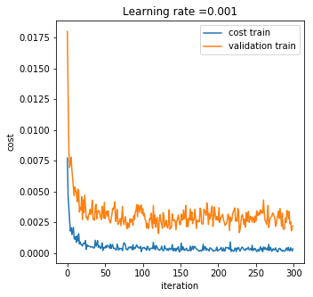


###4.3 Solution Approach

To check the accuracy of the model, I pick up 5 German traffic signs from Internet.

The pipeline follows the steps below:

1.  read the images from the folder
2. preprocessing the images: resize and rgb2clahe
3. run the network *LeNet*
4. print the top 5 prediction results
5. print the prediction results.

* Load the images with relevant path

````python
# Load the images from folder with relevant path
path = './traffic-sign-test-data/'

def read_image(filename):
    image = cv2.imread( path + filename)
    return image

image_files = ['1_12.jpeg', '2_7.jpeg', '3_40.jpeg', '4_25.jpeg', '5_21.jpeg']
new_images = [read_image(filename) for filename in image_files]
res_images = list()
````

* Resize the image to fit the LeNet input layer

````python
# Resize the image to fit the LeNet input layer
def image_resize(image, size_x, size_y):
    res = cv2.resize(image, dsize=(size_x, size_y), interpolation=cv2.INTER_CUBIC)
    return res

def crop_image(image, x, y, w, h):
    crop = image[y:y+h, x:x+w]
    return crop
````

* Example of the first image preprocessing

````python
# Example of the third image after resize
num_image = 2

print(new_images[num_image].shape)
pylab.rcParams['figure.figsize'] = (5,5)
plt.subplot(2,2,1)
plt.imshow(new_images[num_image])
crop = crop_image(new_images[num_image], 10, 5, 150, 120)
res_images.append(image_resize(crop, 32, 32))
plt.subplot(2,2,2)
plt.imshow(res_images[num_image])
crop = crop_image(new_images[num_image], 15, 125, 150, 120)
res_images.append(image_resize(crop, 32, 32))
plt.subplot(2,2,3)
plt.imshow(res_images[num_image + 1])
````

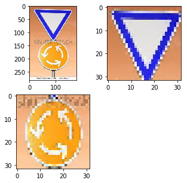

* Conclusion of all the test images

  ````python
  # Test images (python output)
  6 test images.
  image shape: (32, 32, 3)
  ````

  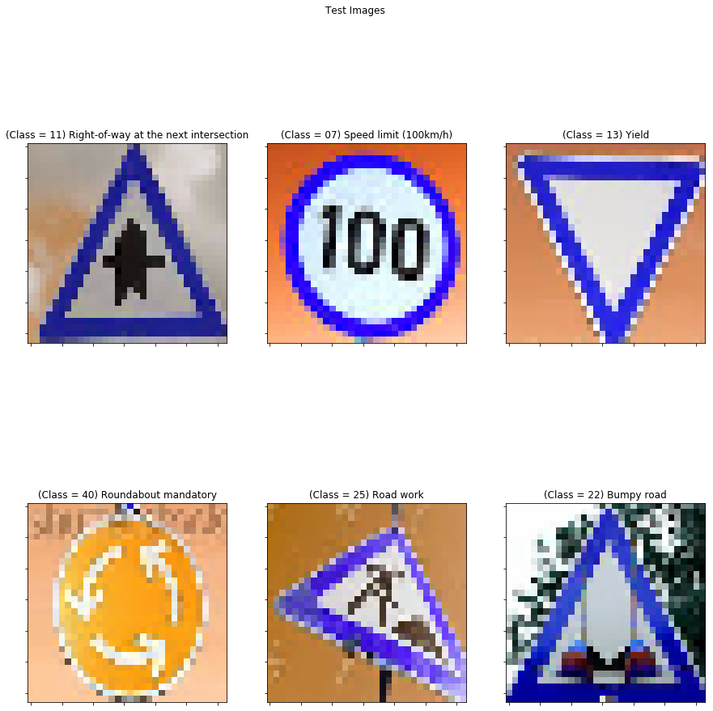

* Convert the rgb images to the clahe images

  ````python
  res_images_cl, tmp, tmp = rgb2clahe(res_images, res_images, res_images, m, m, m, res_images_shape)
  ````

* Run the network

  ````python
  with tf.Session() as sess:
      saver.restore(sess, tf.train.latest_checkpoint('.'))
      new_softmax = tf.nn.softmax(logits)
      topk, index = tf.nn.top_k(new_softmax, k = 5)
      topk_val , indexes = sess.run([topk, index], feed_dict={x: res_images_cl, keep_probs: 1})
  ````

* Print the accuracy

  ````python
  with tf.Session() as sess:
      saver.restore(sess, tf.train.latest_checkpoint('.'))
      test_accuracy, cost_test = evaluate(res_images_cl, new_labels)
      print("Test Accuracy = " + str(test_accuracy))
  ````

  ````python
  # Print the accuracy
  INFO:tensorflow:Restoring parameters from .\lenet-normal-1
  Test Accuracy = 0.3333333432674408
  ````

  The test accuracy shows that 2 of 6 images are predicted correctly.

  

##5. Test images results

  The test result of each image is shown as following one by one.

  ````python
  def visualize_top5(num_image, indexes, probs):
      pylab.rcParams['figure.figsize'] = (5,5)
      plt.imshow(res_images[num_image])
      plt.title("(Class = " + str('{:02d}'.format(new_labels[num_image])) + ") " + sign_name_list[new_labels[num_image]])
      print("Top 5 prediction:")
      prob_index = 0
      for i in indexes:
          print("Class " + str(i) + " " + sign_name_list[i] + " - " + str('{:02.02f}'.format(probs[prob_index]*100)) + "%")
          prob_index += 1
      if indexes[0] == new_labels[num_image]:
          print("Prediction SUCCESS")
      else:
          print("Prediction FAIL")
  ````

  1. 1st test image result 

  ````python
  visualize_top5(0, indexes[0], topk_val[0])
  ````

  Top 5 prediction:
  Class 11 Right-of-way at the next intersection - 79.59%
  Class 27 Pedestrians - 16.91%
  Class 25 Road work - 1.11%
  Class 20 Dangerous curve to the right - 1.00%
  Class 31 Wild animals crossing - 0.83%
  Prediction SUCCESS

  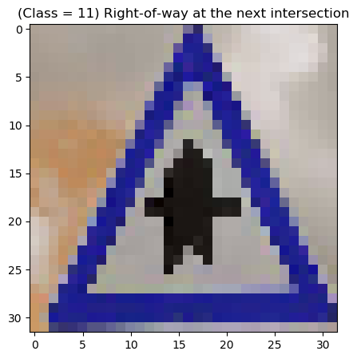

  2. 2nd test image result

     ````python
     visualize_top5(1, indexes[1], topk_val[1])
     ````

     Top 5 prediction:
     Class 3 Speed limit (60km/h) - 69.23%
     Class 5 Speed limit (80km/h) - 19.71%
     Class 7 Speed limit (100km/h) - 8.37%
     Class 2 Speed limit (50km/h) - 2.09%
     Class 8 Speed limit (120km/h) - 0.58%
     Prediction FAIL

     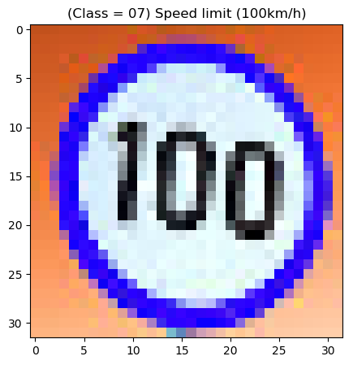

  3. 3rd test image result

     ````python
     visualize_top5(2, indexes[2], topk_val[2])
     ````

     Top 5 prediction:
     Class 13 Yield - 100.00%
     Class 10 No passing for vehicles over 3.5 metric tons - 0.00%
     Class 15 No vehicles - 0.00%
     Class 38 Keep right - 0.00%
     Class 5 Speed limit (80km/h) - 0.00%
     Prediction SUCCESS

     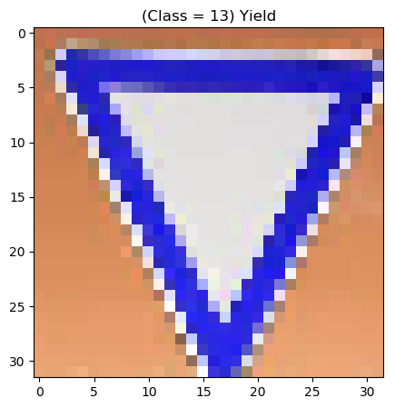

  4. 4th test image result

     ````python
     visualize_top5(3, indexes[3], topk_val[3])
     ````

     Top 5 prediction:
     Class 7 Speed limit (100km/h) - 65.94%
     Class 38 Keep right - 14.65%
     Class 14 Stop - 8.98%
     Class 2 Speed limit (50km/h) - 3.16%
     Class 40 Roundabout mandatory - 2.57%
     Prediction FAIL

     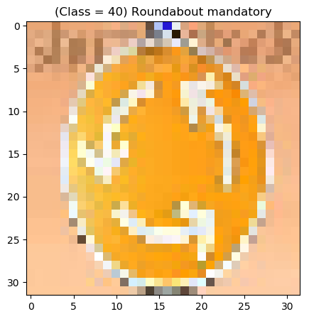

  5. 5th test image result

     ````python
     visualize_top5(4, indexes[4], topk_val[4])
     ````

     Top 5 prediction:
     Class 1 Speed limit (30km/h) - 91.27%
     Class 30 Beware of ice/snow - 2.89%
     Class 0 Speed limit (20km/h) - 2.89%
     Class 38 Keep right - 2.71%
     Class 28 Children crossing - 0.16%
     Prediction FAIL

     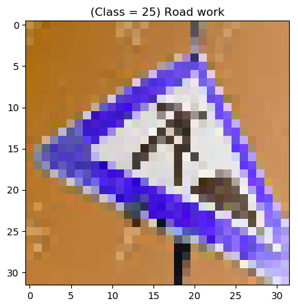

  6. 6th test image result

     ````python
     visualize_top5(5, indexes[5], topk_val[5])
     ````

     Top 5 prediction:
     Class 15 No vehicles - 65.46%
     Class 18 General caution - 11.70%
     Class 35 Ahead only - 11.42%
     Class 37 Go straight or left - 4.83%
     Class 34 Turn left ahead - 1.89%
     Prediction FAIL

     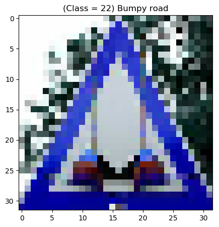

## 6. Conclusion

The test image accuracy (33.33%) is much lower than the test accuracy (94.3%) after training the model.

There are several reasons which causes this result.

1. Test image selection

   I pick some tricky images on purpose. These traffic signs are taken from different angle with distortion. The last image is additionally added other noise. Those elements are different as what I used to train the *LeNet*. So some test images are totally new for the model, which the model has never trained.

   I cropped and resized the test images, but it is not enough. Future, the image distortion correction needs to be added.

2. The neuron network

   The neuron network what I choose in this model is not deep enough. From the cost-iteration figure, after 300 epoch, the training cost is still bit higher. The high bias can be reduced by longer iteration, deeper network and etc.

   The high variance is obvious. The validation cost is much higher than the training cost. The high variance can be reduced by the regularization, the batch normalization, more data and etc.

   The training speed is slow. After 300 epoch, the training accuracy stays around 98% and the validation accuracy stays around 96%. The hyper-parameter learning rate may accelerate the training speed but after tuning, the higher learning rate causes overshot. This will lead the gradient descent fail to coverage.

3. Data generator

   Based on the second point, to reduce the high variance, more data may help solve the problem. In this model, I used `Keras` framework. It may help if using other method to generate more data, distorting, zooming, rotating, etc.