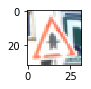
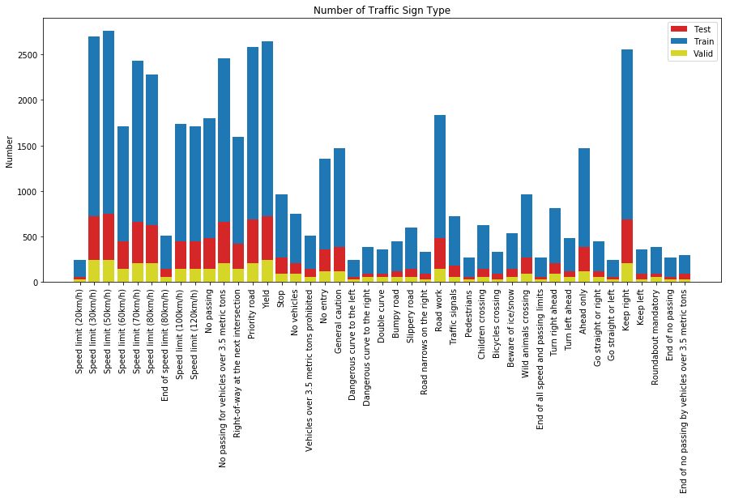
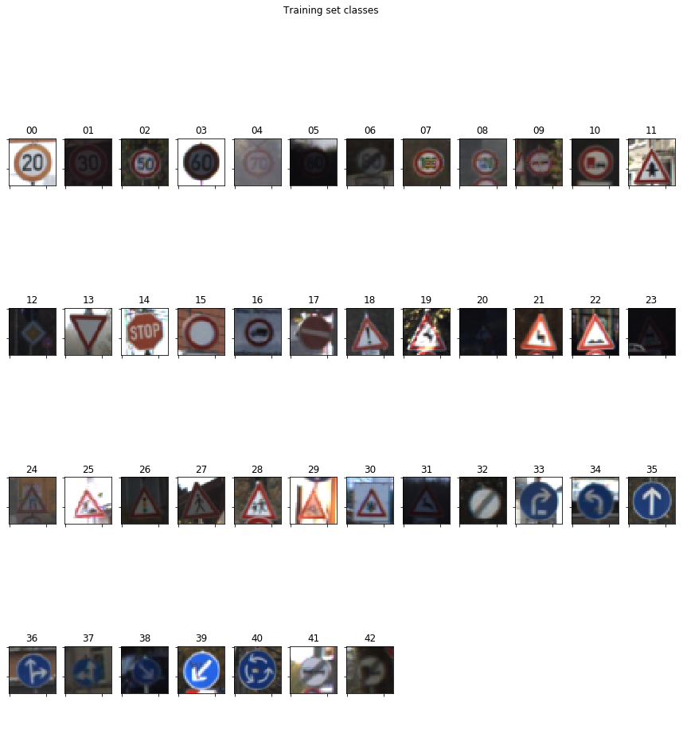

# Project: Build a Traffic Sign Recognition Program

[](http://www.udacity.com/drive)

##1. Overview
The goal of this project is to build the traffic sign recognition successfully.

The dataset is from [German Traffic Sign Dataset](http://benchmark.ini.rub.de/?section=gtsrb&subsection=dataset). After the model is trained, 5 test images picked from internet are used to test the model accuracy.

The goals / steps of this project are the following:

- Load the data set
- Explore, summarize and visualize the data set
- Design, train and test a model architecture
- Use the model to make predictions on new images
- Analyze the softmax probabilities of the new images
- Summarize the results with a written report


##2. Project Preparation

1. Dependencies

   This lab requires [CarND-Term1-Starter-Kit](https://github.com/udacity/CarND-Term1-Starter-Kit)

   The lab environment can be created with CarND Term1 Starter Kit. Click [here](https://github.com/udacity/CarND-Term1-Starter-Kit/blob/master/README.md) for the details.

2. Dataset and Repository

3. Download the data set. The classroom has a link to the data set in the "Project Instructions" content. This is a pickled dataset in which we've already resized the images to 32x32. It contains a training, validation and test set.

4. Clone the project, which contains the Ipython notebook and the writeup template.

```sh
git clone https://github.com/udacity/CarND-Traffic-Sign-Classifier-Project
cd CarND-Traffic-Sign-Classifier-Project
jupyter notebook Traffic_Sign_Classifier.ipynb
```

##3. Project Introduction
This project is using the convolutional neural network to classify the German traffic sign. The advantage of using the CNN is that it can improve the accurary based on the huge dataset comparing the traditional image process, such as OpenCV.
The model of CNN in this project is based on LeNet-5 from the class.

##4. Project Pipeline
The workflow of this project is followed by the pipeline below:

1. *Design and Test a Model Architecture*
	1. Preprocessing
	2. Model Architecture
	3. Model Training
	4. Solution Approach
2. *Test a Model on New Images*
	1. Acquiring New Images
	2. Performance on New Images
	3. Model Certainty - Softmax Probabilities

###4.1 Design and Test a Model Architecture
####4.1.1 Preprocessing

1. Data Load

   The convolutional neural network needs quite a lot of data.  [German Traffic Sign Dataset](http://benchmark.ini.rub.de/?section=gtsrb&subsection=dataset) provides the examples and the labels. The first block is to read the training examples, the validation examples and the test examples.

   ````python
   training_file = './train.p'
   validation_file= './valid.p'
   testing_file = './test.p'

   with open(training_file, mode='rb') as f:
       train = pickle.load(f)
   with open(validation_file, mode='rb') as f:
       valid = pickle.load(f)
   with open(testing_file, mode='rb') as f:
       test = pickle.load(f)
       
   X_train, y_train = train['features'], train['labels']
   X_valid, y_valid = valid['features'], valid['labels']
   X_test, y_test = test['features'], test['labels']
   ````

   The groups of different examples are ready. `X_train` and `y_train` are for training examples; `X_valid` and `y_valid` are for validation examples; and `X_test` and `y_test` are for test examples.

   The size of each group can also be extracted by simply using `numpy`:

   ````python
   n_train = len(X_train)
   n_validation = len(X_valid)
   n_test = len(X_test)
   image_shape = X_train[0].shape
   n_classes = len(np.unique(y_train))
   ````

   ````sh
   # Output
   Number of training examples = 34799
   Number of testing examples = 12630
   Image data shape = (32, 32, 3)
   Number of classes = 43
   ````

2. Data Visualization

   Visualizing the examples is easier for understanding and for preprocessing. The visualization is separated into 3 parts: 

   * Randomly plot 1 training example and its class
   * Plot the number of traffic sign in the training examples and in the test examples
   * Plot all the classes with classes' number and sign name

   ````python
   import random
   import matplotlib.pyplot as plt

   %matplotlib inline

   index = random.randint(0, len(X_train))
   image = X_train[index].squeeze()
   plt.figure(figsize=(1,1))
   plt.imshow(image)
   print(y_train[index])
   ````

   ````
   # Output
   11
   ````

   

   The motivation to plot the number of traffic sign type is to check if there is uneven distribution. The uneven distribution will have impact on the accurary if the regularization is missiong. For instance, if the data set has much more example on the class 11 than on the class 1, the prediction will be more likely to predict the class 11.

   

   The result shows that the distribution is uneven, *bias* is necessary.

   The following figure shows the classes.

   ````python
   rows, cols = 4, 12

   fig, ax = plt.subplots(rows, cols, figsize=(15,15)) 
   plt.suptitle('Training set classes')
   for i_class, i_ax in enumerate(ax.ravel()):
       if i_class < n_classes:
           X = X_train[y_train == i_class]
           img = X[np.random.randint(len(X))]
           i_ax.imshow(img)
           i_ax.set_title('{:02d}'.format(i_class))
       else:
           i_ax.axis('off')

   plt.setp([a.get_xticklabels() for a in ax.ravel()], visible=False)
   plt.setp([a.get_yticklabels() for a in ax.ravel()], visible=False)

   plt.draw()
   ````

   

3. Pre-process the data set

   The following technique is used to pre-process the data set:

   * Normalisation and RGB2GREY
   * More data generation

   1. Normalisation and RGB2GREY

      - `clahecvt_norm`

        CLAHE is the abbreviation of Contrast-limited Adaptive Histogram Equalization. Histogram equalization is a method in image processing of contrast adjustment using the image's histogram.  

        > This method usually increases the global contrast of many images, especially when the usable data of the image is represented by close contrast values. Through this adjustment, the intensities can be better distributed on the histogram. This allows for areas of lower local contrast to gain a higher contrast. Histogram equalisation accomplishes this by effectively spreading out the most frequent intensity values.
        >
        > The method is useful in images with backgrounds and foregrounds that are both bright or both dark. 
        >
        > > [Histogram Equlization]: https://en.wikipedia.org/wiki/Histogram_equalization

        ```python
        def clahecvt_norm(original_images, clahe_images):
            clahe = cv2.createCLAHE()
            for i in range(len(original_images)):
                image = original_images[i].squeeze()
                gray_image = cv2.cvtColor(image, cv2.COLOR_RGB2GRAY)
                clahe_images[i,:,:,0] = clahe.apply(gray_image)
            clahe_images = clahe_images.astype(int)
            clahe_images -= 128

        X_train_cl = np.ndarray(shape=(n_train, image_shape[0], image_shape[1], 1), dtype=np.uint8)
        X_valid_cl = np.ndarray(shape=(n_validation, image_shape[0], image_shape[1], 1), dtype=np.uint8)
        X_test_cl = np.ndarray(shape=(n_test, image_shape[0], image_shape[1], 1), dtype=np.uint8)
        clahecvt_norm(X_train, X_train_cl)
        clahecvt_norm(X_valid, X_valid_cl)
        clahecvt_norm(X_test, X_test_cl)
        ```

      - `rgb2yuv_norm`

        This method is referred to the article:

        > [Traffic Sign Recognition with Multi-Scale Convolutional Networks]: http://yann.lecun.com/exdb/publis/pdf/sermanet-ijcnn-11.pdf

        ```python
        def rgb2yuv_norm(X, equalize_hist=True):
            X = np.array([np.expand_dims(cv2.cvtColor(rgb_img, cv2.COLOR_RGB2YUV)[:, :, 0], 2) for rgb_img in X])
            if equalize_hist:
                X = np.array([np.expand_dims(cv2.equalizeHist(img), 2) for img in X])
            X = np.float32(X)
            X -= np.mean(X, axis=0)
            X /= (np.std(X, axis=0) + np.finfo('float32').eps)
            return X

        X_train_yuv = rgb2yuv_norm(X_train)
        X_valid_yuv = rgb2yuv_norm(X_valid)
        X_test_yuv = rgb2yuv_norm(X_test)
        ```

        > YUV is a color encoding system typically used as part of a color image pipeline. It encodes a colour image or video taking human perception into account, allowing reduced bandwidth for chrominance components, thereby typically enabling transmission errors or compression artefacts to be more efficiently masked by the human perception than using a "direct" RGB-representation. Other colour encodings have similar properties, and the main reason to implement or investigate properties of Y′UV would be for interfacing with analog or digital television or photographic equipment that conforms to certain Y′UV standards.
        >
        > > [YUV]: https://en.wikipedia.org/wiki/YUV


      These 2 methods are using different normalisation. `clahecvt_norm` normalises the data between -127 to 128, and `rgb2yuv_norm` normalises the data by using standard normalisation. 

      The output shows below.

      ```
      # Output
      Right-of-way at the next intersection
      <matplotlib.image.AxesImage at 0x12c032240>
      ```

      

      In the submitted version, `clahecvt_norm` is chosen because it gets higher validation accuracy.

   2. More data generation

      ​

####4.1.2 Model Architecture


####4.1.3 Model Training

####4.1.4 Solution Approach